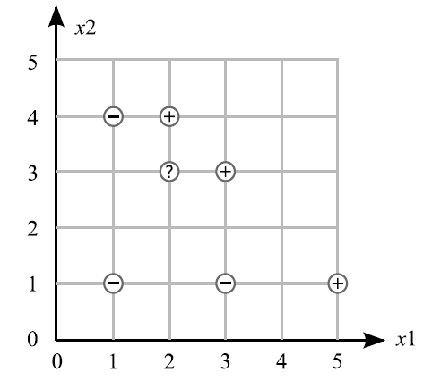

### Data Points
- **Negative Class (-1)**: (1, 1), (3, 1), (1, 4)
- **Positive Class (+1)**: (2, 4), (3, 3), (5, 1)

An unknown point is located at (2, 3) (Questions 1-4).

### Questions

#### Q1. Perceptron Algorithm Simulation
Assume that the points are examined in the order given above, starting with the negative points and then the positive points. Simulate one iteration of the perceptron algorithm with:
- Learning rate ($\eta$) = 0.5
- Initial weight vector $\mathbf{w}$ = (-15, 5, 3)

#### Q2. Decision Boundary
What is the equation of the decision line using the final weights from Question 1?

#### Q3. Linear Separability
Is this line a linear separator of the data?

#### Q4. Classification and Margin
Using this line:
1. What would be the predicted class of the unknown point (2, 3)?
2. What is the margin of this point using the predicted class?

#### Q5. Adaline Algorithm
For which kind of problem is the Adaline algorithm the best?

#### Q6. Backpropagation Algorithm
For which kind of problem is the Backpropagation algorithm the best?

#### Q7. Perceptron Algorithm
For which kind of problem is the Perceptron algorithm the best?

#### Q8. Multi-layer Perceptron Output Function
What would happen if the output function in a multi-layer perceptron would be omitted; i.e., if the output would simply be the weighted sum of all input signals? Why is that simpler output not normally used in MLPs although it would simplify and accelerate the calculations for the backpropagation algorithm?

#### Q9. XOR Problem
Consider a classical XOR example (two same inputs give 1 and different inputs give 0):
1. How does the decision line look like?
2. Is a simple, one-layer perceptron able to realize this function?
3. Show by symbolic representations that the simple one-layer perceptron with two inputs $x_1$ and $x_2$ as well as a threshold ($\theta$) cannot realize the XOR function.
