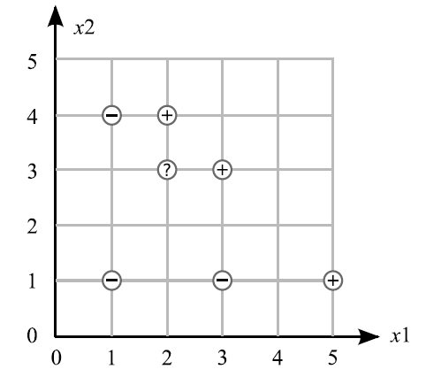

Data points are: Negative: (1, 1) (3, 1) (1, 4) Positive: (2, 4) (3, 3) (5, 1). Data points are classified as either +1 or -1. An unknown point is located at (2, 3)(Q 1-4).

Q1. Assume that the points are examined in the order given above, starting with the negative points and then the positive points. Simulate one iteration of the perceptron algorithm with a learning rate of 0.5 and an initial weight vector of (-15 5 3).

Q2. What is the equation of this line using the final weights from Question 1.

Q3. Is this line a linear separator of the data?

Q4. Using this line, what would be the predicted class of the unknown point (2, 3)? What is the margin of this point using the predicted class?

Q5. For which kind of problem is the Adaline algorithm the best ?

Q6. For which kind of problem is the Backpropagation algorithm the best ?

Q7. For which kind of problem is the Perceptron algorithm the best ?

Q8. What would happen if the output function in a multi-layer perceptron would be omitted; i.e. if the output would simply be the weighted sum of all input signals? Why is that simpler output not normally used in MLPs although it would simplify and accelerate the calculations for the backpropogation algorithm?

Q9. Consider a classical xor example(two same inputs give 1 and diffrent inputs give 0). How does the decision line look like? Is a simple, one-layer perceptron able to realize this function? Show by symbolic representations that the simple one-layer perceptron with two inputs x1 and x2 as well as a threshold (theta) cannot realize the xor function.
